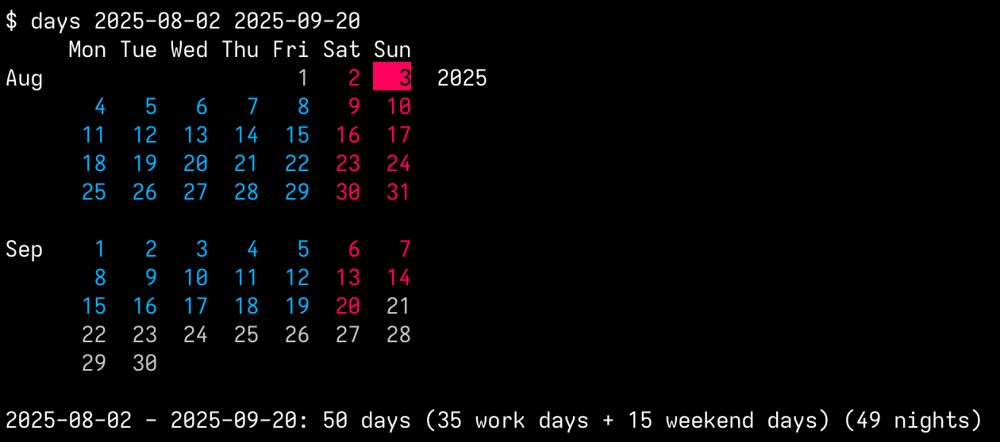

# Days

[](LICENSE)

Prints date spans.

</br>
</br>
</br>

## Usage
```
$ days                        # Prints current month
$ days 2025-08-02 +6          # Prints span 2025-08-02 plus 6 days
$ days 2025-08-02 -3          # Prints span 2025-08-02 minus 3 days
$ days 2025-08-02 2025-09-20  # Prints span 2025-08-02 - 2025-09-20
```

## Installation
```
$ go install github.com/jsageryd/days@latest
```
